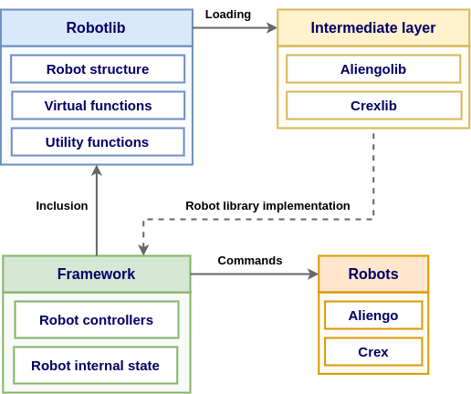

# Robotlib

## Overview
Robotlib is a modular and generic robot software interface that allows the same locomotion framework to run on robots with different morphologies. It was implemented within the project [ANT](https://www.dfki.de/en/web/research/projects-and-publications/project/ant/) as a generic software module to interface with robots having different morphologies: the quadruped Aliengo and the hexapod Crex. For more detail about the project, read the paper [Towards a generic navigation and locomotion control system for legged space exploration](https://az659834.vo.msecnd.net/eventsairwesteuprod/production-atpi-public/7bfd9084af194454bbc98fa9c9d7b648).

Robotlib is based on a factory design pattern that allows the creation of objects (i.e. robot objects) without exposing it to the client, leading to a modular architecture, plug-in based, exploiting polymorphisms and dlopen API. It provides a templated robot morphology that defines the hierarchical structure of limbs with associated kinematic and dynamic data. Additionally, it provides virtual and utility functions for the robot kinematics, dynamics, and jacobians. Each robot-specific library inherits the Robotlib interface to implement the particular morphology, kinematics, and dynamics of each different robot. Thanks to polymorphisms, it is possible to use the interface to access the deepest robot specific implementation of functions declared or defined in Robotlib.

However, polymorphisms per se is not enough to achieve a plug-in based architecture. Here is why dlopen API comes in handy. The dlopen API, allows to dynamically load shared libraries representing the concrete implementation of the interface, i.e. robot specific libraries. This is achieved by defining 2 class factory functions inside the interface, defined as extern "C" to avoid name mangling. One function creates a class instance, the other one allows to destroy it.

With this architecture you just need to:
- Write your controller based on **Robotlib**
- Implement the **Glue code**, that is the robot specific libraries
- **Loading at runtime** the robot library associated to the robot you want to control

Through the common interface, it is therefore possible to keep one single controller implementation for controlling robots with different morphologies.

In the image below you can see an overview of how Robotlib and the robot specific libraries are integrated in a controller framework. Here Aliengolib and Crexlib are the glue code respectively of Aliengo and Crex.

Notice that the robot states are decoupled from the hierarchical robot structure. This means that a robot object does not store any robot state like joint configuration, joint velocities, stance status per leg etc. It provides instead data structures that can be used to define robot states when implementing a controller.

In the following an overview of Robotlib main classes is provided:
* **RobotFactory**: this class stores the static function **openRobot** used to load at runtime the glue code
* **RobotBase**: this is the main class used as interface to glue code. It provides data structures such as **LegDataMap**, **JointDataMap**, **JointState** and **Jacobian** classes. It also provides the hierarchical structure of limbs as a sequence of joints and links together with utility functions like **forwardKinematics**, **inverseKinematics** and **inverseDynamics**
* **LimbBase**: this is the class to interface with any kind of limb, no matter if it is a leg or arm
* **Frame**: this class represents a generic frame, no matter if it is a joint or a link

For a complete overview of the inheritance graph, you can check the class hierarchy generated by doxygen (see section [Documentation](#documentation)).

There are several advantages of using an architecture abstraction layer like Robotlib. For example, with Robotlib, robot-specific structures are hidden from the controllers and state estimators, making them more modular and easier to implement. The structure allows controllers and state estimators to be written only once, and then the framework can dynamically load different robots. The abstraction layer also provides an easy way to switch backend libraries that compute the kinematics and dynamics without affecting the rest of the framework.
Robotlib is written in C++17 to be fast and portable. It is compatible with the most adopted robotics libraries and is real-time safe.

## Installation
### Dependencies
Robotlib has been developed and tested on a x86_64 version of Ubuntu 16.04 (Xenial Xerus), Ubunutu 18.04 (Bionic Beaver) and Ubuntu 20.04 (Focal Fossa). The dependencies for building and installing the library are the following:

**CMake** (3.7.0 is the minimum version for Ubuntu 20.04, 3.1.0 is the one for the other versions) - You can download the chosen version and install it through

    wget https://cmake.org/files/v3.X/cmake-3.<X>.<X>-Linux-x86_64.tar.gz
    tar xf cmake-3.<X>.<X>-Linux-x86_64.tar.gz
    export PATH="$PATH:/home/dls_user/cmake-3.<X>.<X>-Linux-x86_64/bin"

You just need to substitue \<X> with the chosen CMake version.

**Eigen3**

    sudo apt install libeigen3-dev

**GTest**

    sudo apt install libgtest-dev

### Building
To build Robotlib, clone this repository
* For Ubuntu 20.04

    git clone git@gitlab.advr.iit.it:dls-lab/robotlib.git

* For Ubuntu 18.04

    git clone git@gitlab.advr.iit.it:dls-lab/robotlib.git -b bionic-develop

* For Ubuntu 16.04

    git clone git@gitlab.advr.iit.it:dls-lab/robotlib.git -b xenial-develop

Then compile the code

    mkdir build

    cd build

    cmake .. -DCMAKE_BUILD_TYPE=Release

    make install

## Usage
Before using Robotlib, you need to install the glue code associated to the robot you want to control. For example, if you want to control the Aliengo quadruped robot you can follow the instructions [here-TODO](TODO) to install its glue code. Essentially, to install a glue code you just need to compile it with `make install`. 

If you don't want to install any glue code but you just want to play aroud with Robotlib you can use one of the dummy robots defined in Robotlib: a dummy quadruped or a dummy hexapod. Their (dummy) glue code is already installed when you install Robotlib.

We can now have a look at an example of using Robotlib. First of all we need to create a robot object, loading at run time the shared library associated to the robot we want to control

    // Instantiate the robot object
    std::shared_ptr<robotlib::RobotBase> robot {robotlib::RobotFactory::openRobot("dummy-quadruped")};

With the openRobot function, the shared library associated to the dummy quadruped robots is loaded at runtime. The real object type is masquerade by the Robotlib interface, and therefore the robot object is used to get robot information and data structures and to use utility functions.

Some robot information can be accessed through the robot object, for example

    // Print some robot information
    std::cout << robot->getName() << std::endl;
    std::cout << robot->getNLEGS() << std::endl;
    std::cout << robot->getNJOINTS() << std::endl;

Suppose now that you want a variable storing the stance status of each leg. You can define a leg data map object in this way

    // Define and populate a leg data map object
    robotlib::RobotBase::LegDataMap<bool> stance_status {robot->makeLegDataMap<bool>(false)}; // or auto stance_status {robot->makeLegDataMap<bool>(0.0)};

The LegDataMap object can be seen as a list of pairs: each pair associates a stored data to a leg.

Notice that the constructor of the LegDataMap class produces not real time operations. With the aim of letting the user managing more carefully not real time operations, the LegDataMap constructor is made private, such that the user is forced to use a RobotBase object to create a LegDataMap one. Each time you see the word *make* inside a Robotlib function name, it means that the function is instantiating a data structure with non real time operations (that is, it allocates dynamic memory).

Let's now populate the stance_status variable

    for(std::shared_ptr<robotlib::LimbBase>  leg: *robot->getLegs()) //or for(auto leg : *robot->getLegs())
    {
        stance_status[leg] = true; //or stance_status[leg->getName()] = true;
        std::cout << leg->getName() << " leg, stored data: " << stance_status[leg] << std::endl;
    }

As you can see in the code above, we use iterators to iterate over a set of legs got from the robot object. In Robotlib there is no way to access to data structures by index. You can access to data by either a class instance or by string. For example, if you want to access to the stance status associated to the left front leg you can do it in one of the following ways

    bool stance {stance_status[robotlib->getLeg("LF")]};
    //or
    stance = stance_status["LF"];

where "LF" is the name associated to the left front leg. The getLeg function returns a std::shared_ptr\<LimbBase> object, that is used to access to the associated data stored in the variable stance_status.

As another example of data type that can be associated to legs consider the following example

    // Define and populate a leg data map objectof jacobians; each jacobian is associated to a leg
    robotlib::RobotBase::LegDataMap<robotlib::RobotBase::Jacobian> feet_jacobian{robot->makeFeetJacobian()}; // or auto jacobian{dummy_quadruped->makeFootJacobian(foot)};
    for (auto leg : *(robot->getLegs()))
    {
        std::cout << "Foot jacobian per " << leg->getName() << " leg: " << std::endl;
        feet_jacobian[leg] << 10, 10, 10,
            20, 20, 20,
            30, 30, 30,
            40, 40, 40,
            50, 50, 50,
            60, 60, 60;
        std::cout << feet_jacobian[leg] << std::endl;
    }

In this example we have used the function makeFeetJacobian (making non real time operations) to create a jacobian object for each leg.

Consider now the following example to compute the forward kinematics for each leg

    // Forward kinematics
    robotlib::RobotBase::JointState q_input{robot->makeJointState(0)};
    robotlib::RobotBase::LegDataMap<Eigen::Matrix<double, 3, 1>> foot_position{robot->makeLegDataMap<Eigen::Matrix<double, 3, 1>>(Eigen::Matrix<double, 3, 1>::Zero())};
    robot->forwardKinematics(q_input, foot_position);

The forwardKinematic function takes as input a joint configuration and overwrite the foot_position variable after having computed the forward kinematics. This is an example of virtual function defined in the RobotBase class, whose implementation is defined in the glue code. Thanks to opendl API and polymorphisms, it is possible to access to its implementation through the Robotlib interface.

Finally, you can run an executable to show robot information. The executable is called *robot_info* and it is generated in the *build/src* folder after building Robotilb. The executable can be run as follows

    ./robot_info <robot_library> --info

For example

    ./robot_info dummy-quadruped --info

or in case of Aliengo robot

    ./robot_info aliengolib --info

where *aliengolib* is the name of the installed glue code library for Aliengo.
## Documentation
The Robotlib documentation is written using Doxygen. To generate the documentation go in the folder *doc* and execute the following command

    doxygen robotlib_doxygen.conf

Latex and html files will be generated according to the instructions provided in the configuration file robotlib_doxygen.conf. 

To access to the html documentation, just double click on the file *index.html* stored in the folder *doc/html*: it will open the file in your browser.

To view the inheritance graph, once the html file is opended in your browser, go in the Classes section and click on the Class Hierarchy tab.

Notice that in the doxygen documentation for each function it is also specified if it can be executed in real time or not.

## Tests
The tests are based on GoogleTests: the Google's C++ test framework. The tests relies on glue codes associated to dummy robots generated with the only purpose of testing.

To run tests

    mkdir build

    cd build

    cmake .. -DCMAKE_BUILD_TYPE=Debug -DBUILD_TESTING=On

    make install

    make check

## Pipeline status

### Develop

|  **Ubuntu OS**  |  **Build status**  |   **Test coverage - Lines**  |   **Test coverage - Functions**  |
| :-------------: | :----------------: | :--------------------------: | :------------------------------: |
| Focal Fossa |  |  |  |
| Bionic Beaver |  |  |  |
| Xenial Xerus |  |  |  |

### Release

|  **Stable branch**  |  **Build status**  |   **Test coverage - Lines**  |   **Test coverage - Functions**  |
| :------------------: | :----------------: | :--------------------------: | :------------------------------: |
| master |  |  |  |

<!-- TODO -->
<!-- Actually, master is the release branch for Focal. We need releases for Bionic and Xenial as well -->

## Issues

<!-- TODO -->
<!-- You cannot have methods that return <X>DataMap or JointState etc... You need to pass these as reference -->
<!-- Clean issue tracker and make some internal developments (like Agile tasks) private. Put there only known issues for public -->
You can look for known issues, report bugs and ask for features implementation at the [issue tracker](https://gitlab.advr.iit.it/dls-lab/robotlib/-/issues).
